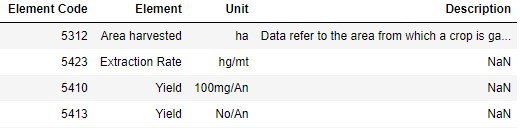

# ETL pipeline using AWS S3 

## Overview
The project's objective is to compile data for a PowerBI dashboard, presenting an overview of production statistics for various products worldwide over the past six decades.

The main data source is [Food and Agriculture Organization of the United Nations](https://www.fao.org/home/en) (FAO) that is enriched by countries' additional information from [REST Countries](https://restcountries.com/) project. The report from FAO is updated once per year and contains of several CSV files. Information from REST Countries project (JSON) also changes not so often. 

## Data Models

### Conceptual Data Model
# 

### High level architecture
# 

### Physical data model
# 

## Description of the data sources
- CountryGroup.csv 
    - description: information about each country's relation to the group (region).
    - contains 910 rows and 7 columns
    - columns: Country Group Code, CountryGroup, Country Code, Country, M49 Code, ISO2 Code, ISO3 Code
    - data example
    

- Elements.csv
    - description: area from which the product is gathered.
    - contains 22 rows and 4 columns
    - columns: Element Code, Element, Unit, Description
    - data example
    

- Flags.csv
    - description: type of the products data in terms of reliability (e.g. official figure, missing value, etc).
    - contains 5 rows and 2 columns
    - columns: Flag, Description
    - data example
    

- ItemGroup.csv
    - description: groups of the products.
    - contains 748 rows and 9 columns
    - columns: Item Group Code, Item Group, Item Code, Item, Factor, CPC Code, HS Code, HS07 Code, HS12 Code
    - data example
    

- Units.csv
    - description: units in which the products are measured.
    - contains 13 rows and 2 columns
    - columns: Unit Name, Description
    - data example
    

- WorldData.csv
    - description: main table with the products, countries, years, production amounts and units.
    - contains 3761168 rows and 13 columns
    - columns: Area Code, Area Code (M49), Area, Item Code, Item Code (CPC), Item, Element Code, Element, Year Code, Year, Unit, Value, Flag
    - data example
    

- API REST Countries 
    - description: additional information about each of the countries is provided.
    - fields: flags (png, svg, alt), name (common, official, nativeName), ccn3, capital, languages, area, population
    - data example
    

## Running a project

### Pre-requisites
- Prepare AWS S3 bucket and User to save the output, change file 'dl.cfg' accordingly.
- Run 'requirements.txt' file to install dependencies for the project.

In the repo 'data' folder that is a zip file that contains all input data, 
all  transformations are done locally, 
result is saved locally and then uploaded to s3 bucket
so nothing should be installed additionally.

### How to run the project
Run 'etl.py' file.

## Choice of technologies and addressing other scenarios

### Tools selection
- Python and Pandas are logical choices to process input data and create a desired output that will be easily used by PowerBI (contains all libraries to read, process and load data);
- Python module called [Dask](https://dask.pydata.org/en/latest/) was used for the biggest data source (WorldData.csv) because it provides more powerful capabilities of calculations than Pandas, but is less powerwul than Apache Spark;
- The data is updated once per year (for FAO data) and from time to time for API, so storing in S3 bucket was a rational choice;
- Data Model is a Star Schema which is a good approach for a PowerBI use case.

### Logical approach under the following scenarios:
- the data was increased by 100x.
- the pipelines would be run on a daily basis by 7pm every day.
- the database needed to be accessed by 100+ people.

1. Use Apache Spark for the faster parallel data processing.
2. Use orchestrating tool, e.g. Apache Airflow.
3. Consider saving output in relational database (e.g. RDS), running calculations in the Cloud (e.g. Lambda or Fargate)
